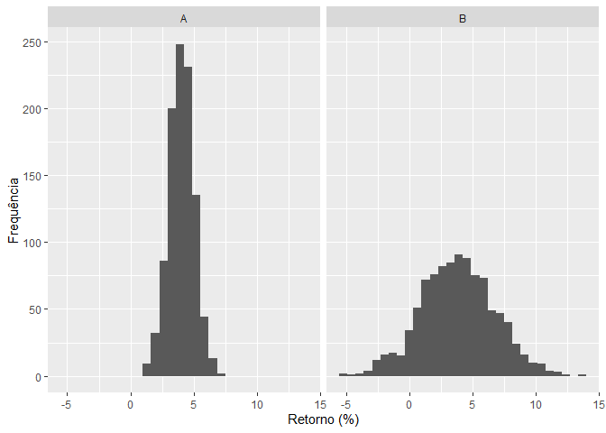

### Definição de risco e retorno

Considere uma série de preços de uma ação em que cada preço de refere a uma observação em um determinado período de tempo:

$$
 P = \{p_1, p_2, ..., p_n\}
$$

Quando se fala em retorno 

O *retorno efetivo*  do ativo no período $t=2$ é dado por $R_2 = p_2 - p_1$. A ideia é que se um agente comprasse o ativo no período 1 ao preço $p_1$ e o vendesse no período 2 ao $p_2$, ele teria o ganho de $R_2$ unidades monetárias. Entretanto, para que essa medida de ganho seja comparável entre ativos diferentes se usa frequentemente o retorno percentual como medida de retorno, isto é:

$$
  R_2 = \frac{p_2 - p_1}{p_1}
$$

Os valores de retornos efetivos já observados são chamados também de retornos históricos.

Uma medida mais interessante para o investidor é qual será o retorno do ativo no futuro. Este tipo de retorno é chamado de *retorno esperado*. Enquanto o retorno efetivo diz respeito ao que ocorreu de fato, o retorno esperado desrespeita ao que ocorrerá no futuro, portanto, uma expectativa. Matematicamente, pode-se definir o retorno esperado como:

$$
 \mu = E(R) = \sum_{i=1}^n{p_iR_i}
$$
Em outros termos, o retorno esperado é o somatório dos retornos do ativo ponderado pelo pelas respectivas probabilidades de ocorrência. Assim, para calcular o retorno esperado pela definição deve-se saber todos os retornos que o ativo pode ter e quais as probabilidades associados a eles. Isso significa dizer que se conhece todos os cenários que podem ocorrer, suas probabilidades e retornos associados a eles. 

Na maioria dos casos não se tem este tipo de conhecimento sobre os retornos de determinado ativo. Nesse caso, os retornos históricos podem serem usados para estimar o retorno esperado, mas não há nenhuma garantia de que o retorno futuro será o mesmo que o já observado no passado. Disto isto, neste *post* o retorno esperado de um ativo será estimado como sendo a média aritmética do retornos históricos. Essa abordagem será adotada em razão da sua simplicidade.

Além da medida de retorno, outra medida de grande importância para os investidores é o risco associado aos ativos. Tal métrica mede o quanto em média o valor do retorno efetivo irá divergir do retorno esperado. Isso significa que ativos com risco alto têm retornos efetivos que divergem bastante do retorno esperado, ao mesmo tempo que o ativos menos arriscados têm retornos efetivos que divergem pouco do retorno esperado.

O gráfico a seguir ilustra intuitivamente essa ideia. Considere dois ativos que têm o retorno esperado de 4%, entretanto o ativo *A* possui um risco menor que o ativo *B*:

<!-- -->

Como consequência os retornos efetivos do ativo *A* são bem mais concentrados, ou próximos, ao retorno esperado do ativo. Ao mesmo tempo que os retornos efetivos de ativo *B* são bem mais dispersos. Formalmente, o risco de um ativo é definido como o desvio padrão dos retornos efetivos em relação ao retorno esperado:

$$
  \sigma = (E[(R_i - \mu)^2])^{0,5}
$$

A discussão sobre a viabilidade de calcular o retorno a partir da definição se aplica também para o calculo do risco. Aqui será usado o desvio padrão histórico como estimador para o risco.

### Risco  e retorno para carteiras

Até agora foi abordado o risco e retorno do ponto de vista de um ativo individual. Entretanto, seria interessante analisar vários ativos em conjunto. Essa é a ideia de carteira. De modo geral, uma carteira é um conjunto de ativos, a participação de cada ativo no valor total da carteira é chamado de peso do ativo na carteira. Assim, se um ativo alcança o valor \$ 10 em uma carteira com o valor total de \$ 100, então esse ativo tem peso de 10% na carteira.

Dito isso, o retorno esperado de uma carteira é dada por:

$$
    R_c = \sum_{i=1}^{n}w_i R_i
$$

Em que $n$ é a quantidade de ativos que compõe a carteira, $w_i$ a participação de do ativo $i$ na carteira e $R_i$ o retorno esperado do ativo $i$. Usando a notação matricial podemos descrever essa relação como um produto interno entre dois vetores:

$$
R_c = w'R
$$
Sendo $w$ um vetor coluna com as participações dos ativos na carteira e $w'$ a sua transporta e $R$ outro vetor coluna que contém os retornos dos ativos da carteira:

$$
w = \begin{bmatrix}
    w_{1}  \\
    w_{2}  \\
    \vdots \\
    w_{n}       
\end{bmatrix},
w' = \begin{bmatrix}
    w_1 & w_2 & \dots & w_n
\end{bmatrix},
R = \begin{bmatrix}
    R_{1}  \\
    R_{2}  \\
    \vdots \\
    R_{n}       
\end{bmatrix}
$$

De agora em diante, um vetor sempre será tratado como uma matriz com uma coluna.

Já o variância da carteira - quadrado do seu risco - é definida como:

$$
    Var(R_p) = w_iw_j\sum_{i}\sum_{j} cov(R_i,R_j)
$$

Para o caso de uma carteira com dois ativo podemos reescrever a relação como:

$$
\begin{equation}
  \begin{split}
    Var(R_p) & =  w_1w_1cov(R_1, R_1) + w_1w_2cov(R_1, R_2) + w_2w_1cov(R_2, R_1) + w_2w_2cov(R_2, R_2) \\
    Var(R_p) & =  w_1^2\sigma_{11} + w_1w_2\sigma_{12} + w_2w_1\sigma_{21} + w_2^2\sigma_{22}
  \end{split}
\end{equation}
$$

Sendo $cov(R_i,R_i) = var(R_i) = \sigma_{ii} = \sigma_{i}^2$ e $cov(R_i, R_j) = cov(R_j, R_i)$ segue:

$$
  Var(R_p) = w_1^2\sigma_1^2 + 2w_1w_2\sigma_{12} + w_2^2\sigma_{2}^2
$$

Diferente do caso do retorno, o risco de uma carteira não é igual à média ponderada dos riscos de cada ativo. A razão para isso é que em geral sempre há uma relação entre a evolução de um preço de ativo $A$ e um ativo $B$, por exemplo, há um relação entre a evolução dos preços das ações da Petrobras e da Vale dado que ambas exportam *commodities*. No caso da carteira com dois ativos, o relacionamentos entre os dois ativos é captado pela covariância entre eles, $\sigma_{12}$.

O risco de uma carteira com *n* ativos pode ser definido como:

$$
  Var(R_p) = w'\Omega w
$$
Novamente $w$ é o vetor com a participação de cada ativo na carteira, já $\Omega$ é a matriz do covariância dos retornos dos ativos:

$$
\Omega = \begin{bmatrix}
    \sigma_{11} & \sigma_{12} & \dots & \sigma_{1n} \\
    \sigma_{21} & \sigma_{22} & \dots & \sigma_{2n} \\
    \vdots & \vdots & \ddots & \vdots \\
    \sigma_{n1} & \sigma_{n2} & \dots & \sigma_{nn}
\end{bmatrix}
$$

Assim, cada célula $\sigma_{ij}$ da matriz é a covariância entre os retornos do ativo $i$ e dos retornos do ativo $j$. Como $\sigma_{ij} = \sigma_{ji}$, $\Omega$ é uma matriz simétrica cuja diagonal é a variância dos ativos.
