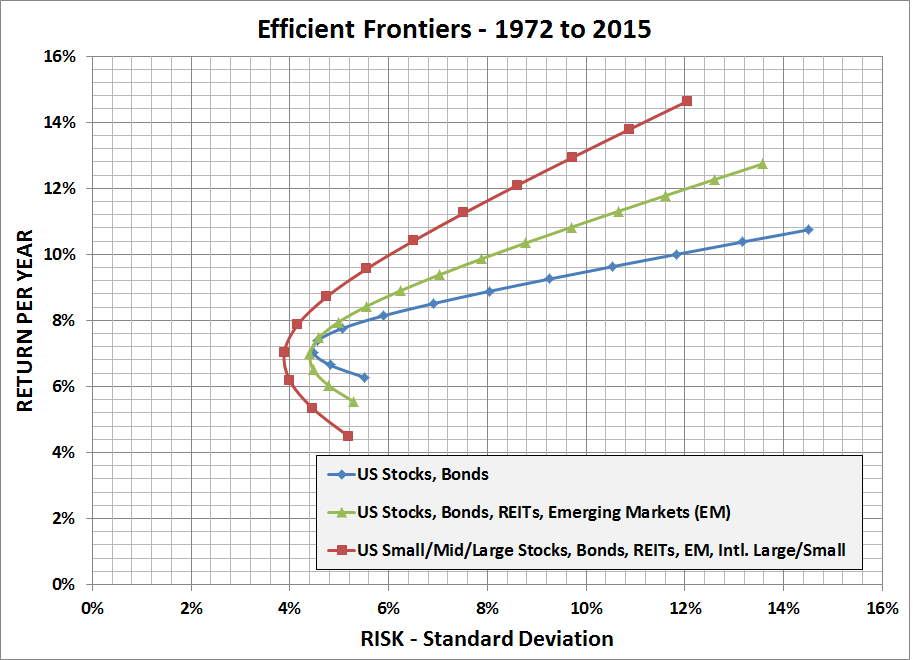

```{r setup, include=FALSE}
knitr::opts_chunk$set(echo = TRUE)
```

## Tipos de Risco

O risco, pode ser dividido em dois tipos: idiossincrático e sistemático. O risco idiossincrático está associado a variância específica do ativo mensurado, é uma característica única da ativo. No caso, por exemplo, de um seguro para casas, assaltos são riscos idiossincráticos, pois dependendo da vizinhança ou até mesmo da aparência, cada casa possui uma chance de ser assaltada ou não, e, não necessariamente, caso uma casa seja assaltada as outras serão também.

Já o risco sistemático é aquele ao qual estão sujeitos todos os ativos negociados, isso inclui não só ativos que estão listados em bolsas, como também os negociados em mercados de balcão, moedas, etc. Voltando ao exemplo do seguro, o risco sistemático seria a chance de haver um desastre natural que atingisse todas as casas, independente de qualquer característica individual de cada casa.

## Diversificação

Segundo a teoria de carteiras de Markowitz, o retorno esperado de uma carteira é a média ponderada dos retornos esperados dos artivos que compõem a carteira.Já o risco total do portfólio não depende apenas do risco de cada ativo incluso na carteira, mas também da correlação entre esses ativos, conforme visto anteriormente.

Para entender a diversificação, podemos voltar ao exemplo de uma companhia de seguros. Digamos que existem apenas dois riscos envolvendo as casas asseguradas de uma cidade: desastres naturais e roubos. Não é possível a seguradora evitar que ocorram desastres ou que as casas não sejam atingidas por eles, esse risco também pode ser maior ou menor dependendo da época do ano. Porém, os roubos não atingem todas as casas ao mesmo tempo e as ocorrências podem ser maiores a depender de bairro, aparência das casas, etc. Nesse caso, seria prudente que a seguradora tivesse imóveis assegurados dos mais diferentes tipos e também em lugares diferentes. O risco de desastres não é eliminado por diversificação, porém o risco de perdas devido a assaltos diminui quanto maior for a diversificação.

A correlação entre ativos é o que fará o risco aumentar ou diminuir ao montar uma carteira de investimentos.

<div style="text-align:center"%>
<figure>
  
  <figcaption>Efeito diversificacao</figcaption>
</figure>
</div>

<!-- [fonte](https://www.efsga.net/how-to-build-an-optimized-retirement-portfolio) -->

É possível ver no gráfico acima que ao adicionar ativos, é possível reduzir o risco do investimento, as linhas vermelhas, verde e azul são as carteiras eficientes em cada caso de diversificação. Pode-se notar que a linha azul, que contém menor diversidade no portifólio, possui menor retorno esperado do que a linha vermelha em quaisquer de seus pontos e o risco também é maior.
